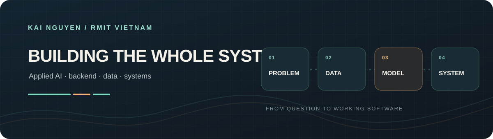
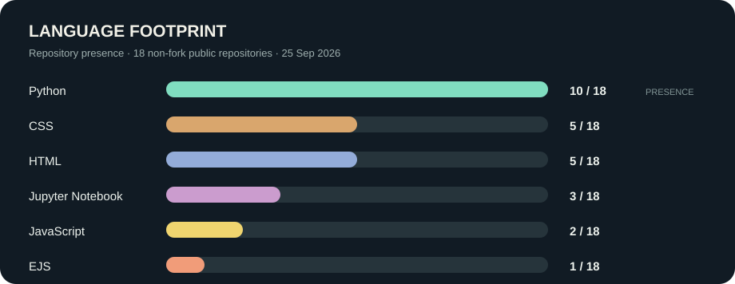

# Kai Nguyen

**B.IT student at RMIT Vietnam · building toward Applied AI / AI Engineering**

I’m learning to take real problems through data, model evaluation, backend design, and a usable interface. I’m especially interested in AI × Finance and applied research, while staying open to other problem domains.

## Selected work

### Fashion Intelligence · team project

[Repository](https://github.com/TrnLin/MLA2) · [integration](https://github.com/TrnLin/MLA2/pull/8) · [season workflow](https://github.com/TrnLin/MLA2/pull/5) · [evaluation handoff](https://github.com/TrnLin/MLA2/pull/15) · model comparisons ([#21](https://github.com/TrnLin/MLA2/pull/21), [#22](https://github.com/TrnLin/MLA2/pull/22), [#23](https://github.com/TrnLin/MLA2/pull/23))

A team system for four fashion-image labels and Top-K visual search. My merged work focused on the season workflow, evaluation handoff, experiment comparisons, and integration.

### ImmuniScope

[Repository](https://github.com/s4126139/ImmuniScope)

A six-page infectious-disease and immunisation data explorer. It uses a layered Python WSGI app, SQLite, parameterised queries, charts, CSV export, and tests around database, query, and route behavior.

### Systems Lab · Week 1

[Repository](https://github.com/s4126139/systems-lab) · [HTTP server notes](https://github.com/s4126139/systems-lab/tree/main/01-networking/http-server)

A learning build of a minimal HTTP/1.1 server directly on TCP sockets, with request-line parsing, response serialization, a health route, and 10 automated tests. The longer systems roadmap is planned work; Week 1 is the implemented milestone.

More web engineering: [Weekly Reading List](https://github.com/s4126139/weekly-reading-list-mock-test) is an RMIT lab app with an Express/MongoDB catalogue, search, pagination, book details, and a shared wishlist.

## Language footprint

Counts are the number of my **18 non-fork public repositories** whose GitHub language metadata includes each language, checked 25 September 2026. Repositories can count toward more than one language; this is repository presence, not code volume or a proficiency score.

## Direction

I’m strengthening the foundations behind complete AI/software systems: algorithms, probability, linear algebra, backend engineering, and computer systems. I’m interested in a research-oriented capstone and collaborations where careful evaluation matters.

**Education:** Bachelor of Information Technology, RMIT University Vietnam · 50% tuition scholarship · Engineering Mathematics: approximately 97.6%.
